Url Sonar\
\
<https://binaries.sonarsource.com/Distribution/sonarqube/sonarqube-26.3.0.120487.zip>

URL java

<https://download.oracle.com/java/21/latest/jdk-21_linux-x64_bin.rpm>

Lista archivo server:\
\
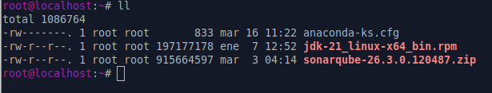{width="5.7652777777777775in"
height="1.0972222222222223in"}

Descomprimimos el sonar

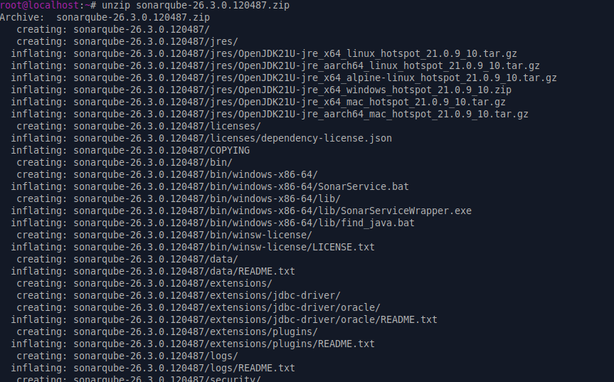{width="5.761111111111111in"
height="3.5854166666666667in"}

Listamos los archivos

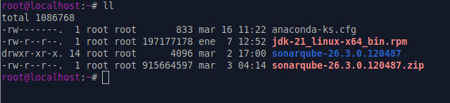{width="5.763888888888889in"
height="1.3263888888888888in"}

Comenzamos con la instalacion de jdk.

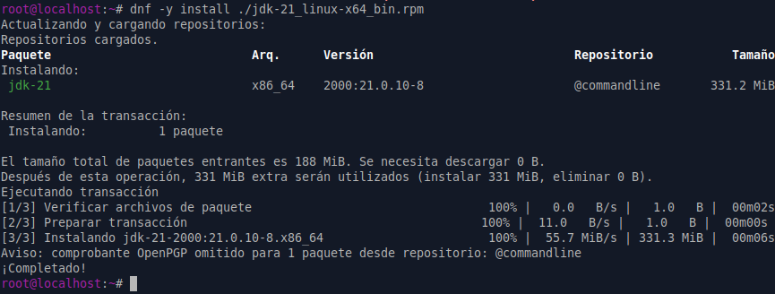{width="5.7659722222222225in"
height="2.186111111111111in"}

Verificamos la version

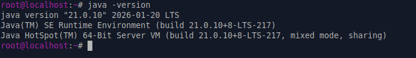{width="5.7625in"
height="0.8111111111111111in"}

Otra verificacion

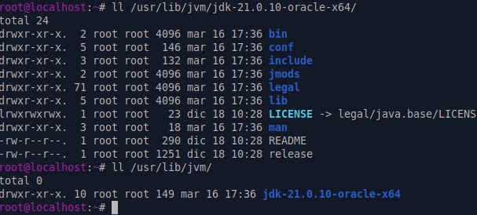{width="5.7659722222222225in"
height="2.6020833333333333in"}

Revisamos el default

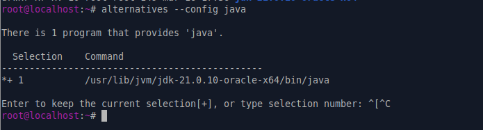{width="5.7625in"
height="1.5506944444444444in"}

Configuraciones relacionadas para funcion de sonar

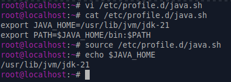{width="4.103472222222222in"
height="1.46875in"}

Empezamos con el movimiento de los archivos a /opt de sonar

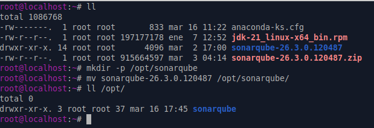{width="5.763888888888889in"
height="1.9833333333333334in"}

Creamos el usuario para sonar

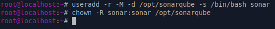{width="5.763194444444444in"
height="0.6229166666666667in"}

Debemos crear parametros para el sistema obligatorio en sonar, por tanto
realizamos los siguientes pasos, por ultimo aplicamos la configuracion.

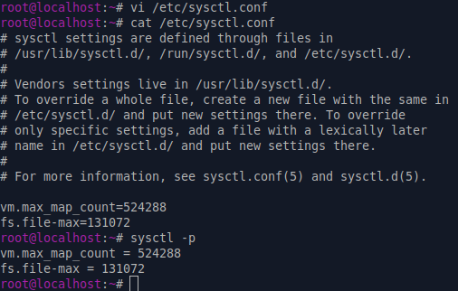{width="5.270138888888889in"
height="3.3534722222222224in"}

Ajustamos los limites del sistema

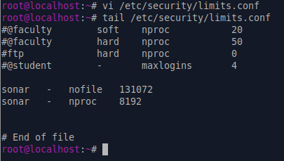{width="4.218055555555556in"
height="2.3854166666666665in"}

Para la instalacion nos movemos al folder donde dejamos nuestros
archivos

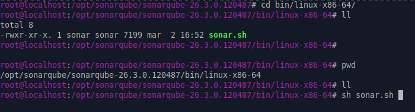{width="5.767361111111111in"
height="1.5652777777777778in"}

Debemos subir con el usuario de sonar con su sonar y ejecutar con la
consola.

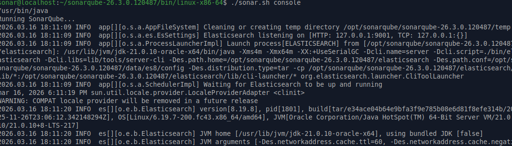{width="5.763194444444444in"
height="1.6569444444444446in"}

Debemos tener retorno en consola y logs

Consola.

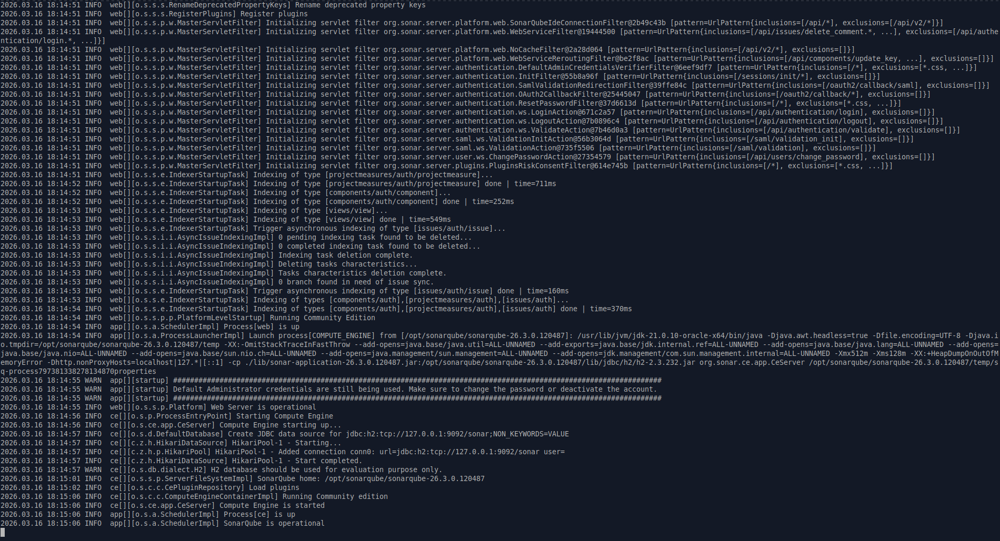{width="5.758333333333334in"
height="3.11875in"}

En los logs:

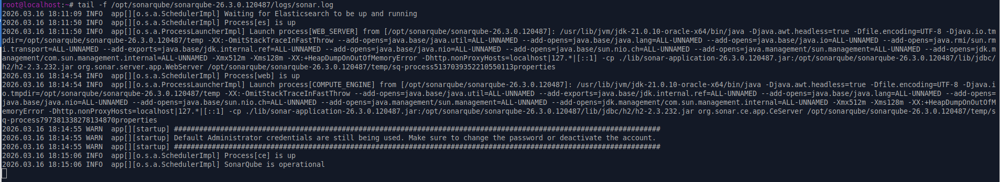{width="5.763194444444444in"
height="1.0541666666666667in"}

Abrimos el puerto 9000

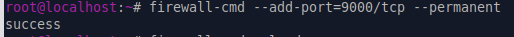{width="5.353472222222222in"
height="0.3854166666666667in"}

Recargamos la configuracion

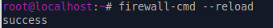{width="3.5305555555555554in"
height="0.3645833333333333in"}

Probamos en nuestra lan local.

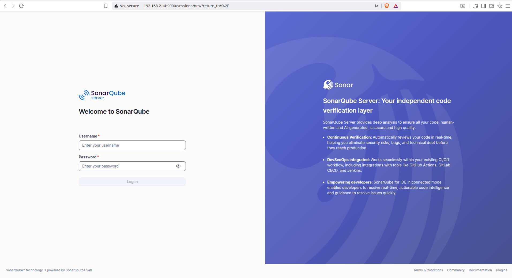{width="5.754861111111111in"
height="3.127083333333333in"}

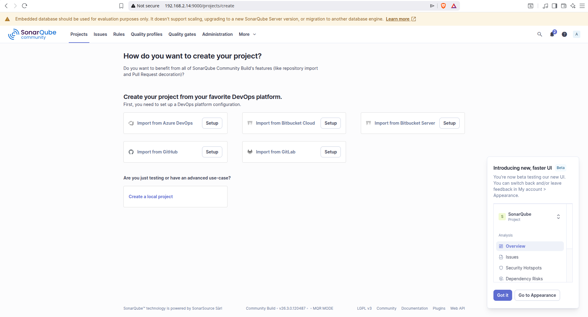{width="5.763888888888889in"
height="3.1152777777777776in"}
